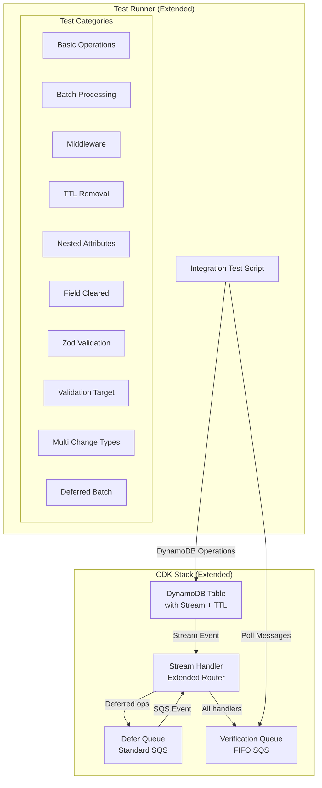

# Design Document: Comprehensive Integration Tests

## Overview

This feature extends the existing integration test infrastructure to provide comprehensive end-to-end testing of all ddb-stream-router library capabilities. The design builds upon the existing CDK stack, Lambda handler, and test runner to add coverage for:

- Batch processing with various grouping strategies
- Middleware execution, filtering, and enrichment
- TTL removal handling and excludeTTL option
- Nested attribute filtering with dot notation
- Field cleared change detection
- Zod schema validation
- Validation target options (newImage, oldImage, both)
- Multiple change types with OR logic
- Deferred batch handlers

The test architecture uses a verification queue pattern where handlers write structured messages that the test runner validates.

## Architecture



## Components and Interfaces

### 1. Extended CDK Stack (`integ/stack.ts`)

The existing stack requires one modification:

```typescript
// Add TTL attribute to table for TTL removal testing
const table = new dynamodb.Table(this, "TestTable", {
  // ... existing config
  timeToLiveAttribute: "ttl", // Enable TTL for testing
});
```

### 2. Extended Lambda Handler (`integ/handler.ts`)

The handler will be extended with additional handlers for each feature:

```typescript
// Extended verification message format
interface VerificationMessage {
  operationType: "INSERT" | "MODIFY" | "REMOVE" | "TTL_REMOVE";
  isDeferred: boolean;
  pk: string;
  sk: string;
  timestamp: number;
  eventId?: string;
  handlerType?: string;
  // New fields for comprehensive testing
  batchCount?: number;           // For batch handlers
  middlewareExecuted?: string[]; // For middleware tracking
  validationTarget?: string;     // For validation target testing
  changeTypes?: string[];        // For change type testing
  nestedPath?: string;           // For nested attribute testing
  parsedWithZod?: boolean;       // For Zod validation testing
}

// Test item interfaces
interface TestItem {
  pk: string;
  sk: string;
  data?: string;
  status?: string;
  count?: number;
  ttl?: number;                  // For TTL testing
  preferences?: {                // For nested attribute testing
    theme?: string;
    notifications?: boolean;
  };
  email?: string | null;         // For field_cleared testing
  validatedField?: string;       // For Zod validation testing
}

interface ZodTestItem {
  pk: string;
  sk: string;
  requiredField: string;
  numericField: number;
}
```

### 3. Handler Registration Categories

#### Batch Processing Handlers

```typescript
// Batch by attribute value
router.onInsert(isTestItem, async (records) => {
  await sendVerification({
    operationType: "INSERT",
    handlerType: "batch-by-status",
    batchCount: records.length,
    // ...
  });
}, { batch: true, batchKey: "status" });

// Batch by primary key
router.onModify(isTestItem, async (records) => {
  await sendVerification({
    operationType: "MODIFY",
    handlerType: "batch-by-pk",
    batchCount: records.length,
    // ...
  });
}, { batch: true, batchKey: { partitionKey: "pk", sortKey: "sk" } });
```

#### Middleware Handlers

```typescript
// Logging middleware
router.use(async (record, next) => {
  middlewareLog.push("middleware-1");
  await next();
});

// Filtering middleware (skips records with specific marker)
router.use(async (record, next) => {
  const newImage = unmarshall(record.dynamodb?.NewImage);
  if (newImage?.skipProcessing) {
    return; // Don't call next() - skip handlers
  }
  await next();
});

// Enrichment middleware
router.use(async (record, next) => {
  (record as any)._enriched = true;
  await next();
});
```

#### TTL Removal Handlers

```typescript
// TTL-specific handler
router.onTTLRemove(isTestItem, async (oldImage, ctx) => {
  await sendVerification({
    operationType: "TTL_REMOVE",
    handlerType: "ttl-remove",
    // ...
  });
});

// User-initiated only (excludeTTL)
router.onRemove(isTestItem, async (oldImage, ctx) => {
  await sendVerification({
    operationType: "REMOVE",
    handlerType: "remove-exclude-ttl",
    // ...
  });
}, { excludeTTL: true });
```

#### Nested Attribute Handlers

```typescript
// Specific nested path
router.onModify(isTestItem, async (oldImage, newImage, ctx) => {
  await sendVerification({
    operationType: "MODIFY",
    handlerType: "nested-theme-change",
    nestedPath: "preferences.theme",
    // ...
  });
}, { attribute: "preferences.theme" });

// Parent path (catches all nested changes)
router.onModify(isTestItem, async (oldImage, newImage, ctx) => {
  await sendVerification({
    operationType: "MODIFY",
    handlerType: "nested-preferences-any",
    nestedPath: "preferences",
    // ...
  });
}, { attribute: "preferences" });
```

#### Field Cleared Handlers

```typescript
router.onModify(isTestItem, async (oldImage, newImage, ctx) => {
  await sendVerification({
    operationType: "MODIFY",
    handlerType: "field-cleared-email",
    // ...
  });
}, { attribute: "email", changeType: "field_cleared" });
```

#### Zod Validation Handlers

```typescript
import { z } from "zod";

const ZodTestSchema = z.object({
  pk: z.string().startsWith("ZOD#"),
  sk: z.string(),
  requiredField: z.string(),
  numericField: z.number(),
});

router.onInsert(ZodTestSchema, async (newImage, ctx) => {
  await sendVerification({
    operationType: "INSERT",
    handlerType: "zod-validated",
    parsedWithZod: true,
    // ...
  });
});
```

#### Validation Target Handlers

```typescript
// Validate newImage only (default)
router.onModify(isTestItem, async (oldImage, newImage, ctx) => {
  await sendVerification({
    handlerType: "validation-target-new",
    validationTarget: "newImage",
    // ...
  });
}, { validationTarget: "newImage" });

// Validate oldImage only
router.onModify(isTestItem, async (oldImage, newImage, ctx) => {
  await sendVerification({
    handlerType: "validation-target-old",
    validationTarget: "oldImage",
    // ...
  });
}, { validationTarget: "oldImage" });

// Validate both
router.onModify(isTestItem, async (oldImage, newImage, ctx) => {
  await sendVerification({
    handlerType: "validation-target-both",
    validationTarget: "both",
    // ...
  });
}, { validationTarget: "both" });
```

#### Multiple Change Types Handlers

```typescript
router.onModify(isTestItem, async (oldImage, newImage, ctx) => {
  await sendVerification({
    handlerType: "multi-change-type",
    changeTypes: ["field_cleared", "changed_attribute"],
    // ...
  });
}, { 
  attribute: "email", 
  changeType: ["field_cleared", "changed_attribute"] 
});
```

### 4. Extended Test Runner (`integ/run-tests.ts`)

The test runner will be organized into test categories:

```typescript
interface TestCategory {
  name: string;
  tests: TestCase[];
}

interface TestCase {
  name: string;
  setup: () => Promise<void>;
  expectedMessages: ExpectedMessage[];
  validate: (messages: VerificationMessage[]) => void;
}

const testCategories: TestCategory[] = [
  {
    name: "Batch Processing",
    tests: [
      {
        name: "Batch by attribute value",
        setup: async () => {
          // Create multiple items with same status
        },
        expectedMessages: [{ handlerType: "batch-by-status", batchCount: 3 }],
        validate: (msgs) => { /* assertions */ }
      },
      // ... more batch tests
    ]
  },
  {
    name: "Middleware",
    tests: [/* middleware tests */]
  },
  // ... more categories
];
```

## Data Models

### Extended DynamoDB Table Schema

| Attribute | Type | Description |
|-----------|------|-------------|
| pk | String | Partition key (e.g., "TEST#item1", "ZOD#item1", "BATCH#item1") |
| sk | String | Sort key (e.g., "v0") |
| data | String | Optional test data |
| status | String | Status field for value filtering |
| ttl | Number | TTL timestamp for TTL removal testing |
| preferences | Map | Nested object for nested attribute testing |
| preferences.theme | String | Nested theme preference |
| preferences.notifications | Boolean | Nested notification preference |
| email | String/Null | Email field for field_cleared testing |
| requiredField | String | Required field for Zod validation |
| numericField | Number | Numeric field for Zod validation |
| skipProcessing | Boolean | Marker for middleware filtering test |

### Extended Verification Message Schema

```typescript
interface VerificationMessage {
  // Existing fields
  operationType: "INSERT" | "MODIFY" | "REMOVE" | "TTL_REMOVE";
  isDeferred: boolean;
  pk: string;
  sk: string;
  timestamp: number;
  eventId?: string;
  handlerType?: string;
  
  // New fields for comprehensive testing
  batchCount?: number;           // Number of records in batch
  batchKey?: string;             // The batch key value
  middlewareExecuted?: string[]; // List of middleware that executed
  validationTarget?: string;     // "newImage" | "oldImage" | "both"
  changeTypes?: string[];        // Change types that matched
  nestedPath?: string;           // Nested attribute path that triggered
  parsedWithZod?: boolean;       // Whether Zod parsing was used
  fieldCleared?: string;         // Name of field that was cleared
}
```

## Correctness Properties

*A property is a characteristic or behavior that should hold true across all valid executions of a system-essentially, a formal statement about what the system should do. Properties serve as the bridge between human-readable specifications and machine-verifiable correctness guarantees.*

Based on the prework analysis, all acceptance criteria for this feature are testable as integration test examples rather than universal properties. This is appropriate because:

1. Integration tests verify specific end-to-end flows in a deployed AWS environment
2. The library's existing property-based tests (in `test/stream-router.property.test.ts`) already cover universal correctness properties
3. Integration tests complement property tests by verifying real AWS behavior with actual DynamoDB streams, Lambda, and SQS

The integration tests will verify the following examples:

**Example 1: Batch processing groups records correctly**
- Create 3 items with status="pending", verify batch handler receives count=3
- Create items with different statuses, verify separate batch invocations
**Validates: Requirements 1.1, 1.3, 1.4**

**Example 2: Middleware executes in order and can filter**
- Register 3 middleware, verify execution order via verification messages
- Have middleware skip a record, verify handlers don't execute
**Validates: Requirements 2.1, 2.2, 2.4**

**Example 3: TTL removal is distinguished from user deletion**
- Create item with TTL, wait for expiration, verify onTTLRemove fires
- Delete item explicitly, verify onTTLRemove does NOT fire
- Delete item explicitly with excludeTTL handler, verify it fires
**Validates: Requirements 3.1, 3.2, 3.3**

**Example 4: Nested attribute filtering works with dot notation**
- Change preferences.theme, verify nested handler fires
- Change preferences.notifications, verify preferences.theme handler does NOT fire
- Change any preference, verify parent path handler fires
**Validates: Requirements 4.1, 4.2, 4.3**

**Example 5: Field cleared detection works**
- Set email to null, verify field_cleared handler fires
- Change email from "a" to "b", verify field_cleared handler does NOT fire
**Validates: Requirements 5.1, 5.3**

**Example 6: Zod validation filters records**
- Create item matching Zod schema, verify handler fires with parsedWithZod=true
- Create item NOT matching schema, verify handler does NOT fire
**Validates: Requirements 6.1, 6.2**

**Example 7: Validation target options work**
- Modify item where only newImage matches, verify validationTarget="newImage" fires
- Modify item where only oldImage matches, verify validationTarget="oldImage" fires
- Modify item where both match, verify validationTarget="both" fires
- Modify item where only one matches, verify validationTarget="both" does NOT fire
**Validates: Requirements 7.1, 7.2, 7.3, 7.4**

**Example 8: Multiple change types use OR logic**
- Clear a field, verify handler with ["field_cleared", "changed_attribute"] fires
- Change a field value, verify same handler fires
**Validates: Requirements 8.1, 8.3**

## Error Handling

| Scenario | Handling |
|----------|----------|
| TTL expiration timeout | Test waits up to 5 minutes for TTL, fails with timeout if not received |
| Batch count mismatch | Test fails with assertion showing expected vs actual count |
| Missing verification message | Test fails after 90s timeout with list of missing messages |
| Middleware execution order wrong | Test fails with expected vs actual order |
| Zod validation error | Record skipped silently, test verifies handler didn't fire |

## Testing Strategy

### Integration Test Organization

Tests are organized by feature category for clear reporting:

```
📊 Test Results by Category
├── Basic Operations (existing)
│   ├── ✅ INSERT immediate
│   ├── ✅ INSERT deferred
│   ├── ✅ MODIFY all changes
│   └── ✅ REMOVE immediate
├── Batch Processing
│   ├── ✅ Batch by attribute value
│   ├── ✅ Batch by primary key
│   └── ✅ Different batch keys
├── Middleware
│   ├── ✅ Execution order
│   ├── ✅ Filtering (skip)
│   └── ✅ Enrichment
├── TTL Removal
│   ├── ✅ onTTLRemove fires
│   ├── ✅ onTTLRemove skips user delete
│   └── ✅ excludeTTL option
├── Nested Attributes
│   ├── ✅ Specific nested path
│   ├── ✅ Sibling path isolation
│   └── ✅ Parent path catches all
├── Field Cleared
│   ├── ✅ Set to null
│   └── ✅ Value change (no fire)
├── Zod Validation
│   ├── ✅ Valid schema
│   └── ✅ Invalid schema (skip)
├── Validation Target
│   ├── ✅ newImage only
│   ├── ✅ oldImage only
│   ├── ✅ both (match)
│   └── ✅ both (partial - no fire)
└── Multiple Change Types
    ├── ✅ OR logic (cleared)
    └── ✅ OR logic (changed)
```

### Test Execution Flow

1. Deploy CDK stack (if not already deployed)
2. Purge verification queue
3. Run each test category sequentially
4. For each test:
   - Perform DynamoDB operations
   - Wait for stream processing (with timeout)
   - Collect verification messages
   - Run assertions
5. Report results by category
6. Exit with appropriate code

### TTL Testing Considerations

TTL removal testing requires special handling:
- DynamoDB TTL deletions can take up to 48 hours (typically within minutes)
- Test creates item with TTL = now + 60 seconds
- Test polls for up to 5 minutes for TTL removal message
- If TTL test times out, it's marked as "skipped" rather than failed
- TTL tests can be run separately with longer timeout

### Dual Testing Approach

This feature uses integration tests exclusively because:
- Property-based tests already exist in `test/stream-router.property.test.ts`
- Integration tests verify real AWS behavior that can't be unit tested
- The verification queue pattern provides deterministic assertions

No additional property-based tests are needed for this feature.
