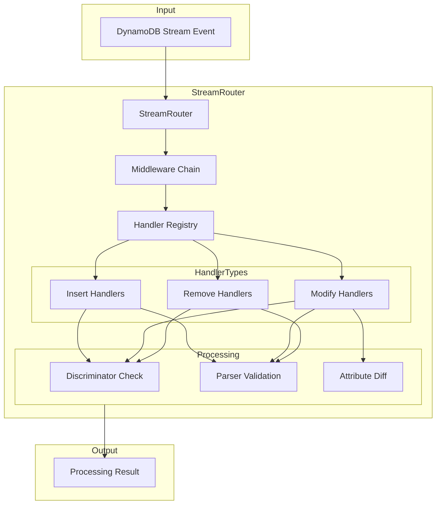

# Design Document

## Overview

The DynamoDB Stream Router is a TypeScript library that provides an Express-like routing pattern for handling DynamoDB Stream events. The library enables developers to register type-safe handlers for INSERT, MODIFY, and REMOVE operations using either discriminator functions (type guards) or parser functions (like Zod schemas).

Key design goals:
- **Express-like API**: Familiar `.insert()`, `.modify()`, `.remove()`, and `.use()` methods
- **Type Safety**: Full TypeScript inference from discriminators and parsers
- **Flexible Matching**: Support both discriminator (type guard) and parser (validation + transformation) patterns
- **Stream View Awareness**: Handler signatures adapt based on configured stream view type
- **Attribute-Level Detection**: Granular change detection for MODIFY events
- **Middleware Support**: Intercept and process records before handlers

## Architecture



The architecture follows a pipeline pattern:
1. **Event Ingestion**: Receives DynamoDB Stream events
2. **Middleware Processing**: Executes middleware chain for each record
3. **Handler Matching**: Matches records to registered handlers by event type and discriminator/parser
4. **Attribute Diffing**: For MODIFY events, optionally detects attribute-level changes
5. **Handler Execution**: Invokes matching handlers with typed data
6. **Result Aggregation**: Returns processing summary

## Components and Interfaces

### Core Types

```typescript
// Stream view type configuration
type StreamViewType = 'KEYS_ONLY' | 'NEW_IMAGE' | 'OLD_IMAGE' | 'NEW_AND_OLD_IMAGES';

// Router configuration options
interface StreamRouterOptions {
  streamViewType?: StreamViewType;
  unmarshall?: boolean;  // Whether to unmarshall DynamoDB JSON to native JS (default: true)
}

// Attribute change types for MODIFY filtering
type AttributeChangeType =
  | 'new_attribute'
  | 'remove_attribute'
  | 'changed_attribute'
  | 'new_item_in_collection'
  | 'remove_item_from_collection'
  | 'changed_item_in_collection';

// Options for modify handlers
interface ModifyHandlerOptions {
  attribute?: string;
  changeType?: AttributeChangeType | AttributeChangeType[];
}

// Generic handler options
interface HandlerOptions {
  batch?: boolean;  // When true, handler receives all matching records as array
}

// Batch handler options with grouping key
interface BatchHandlerOptions extends HandlerOptions {
  batch: true;
  batchKey?: string | ((record: unknown) => string);  // Key to group records by
}
```

### Data Format Handling

DynamoDB Stream records come in DynamoDB JSON format with type descriptors. The router provides an `unmarshall` option to control whether records are converted to native JavaScript objects.

```typescript
// DynamoDB JSON format (raw stream record)
{
  "pk": { "S": "USER#123" },
  "sk": { "S": "PROFILE" },
  "name": { "S": "John" },
  "age": { "N": "30" }
}

// Native JavaScript (unmarshalled)
{
  "pk": "USER#123",
  "sk": "PROFILE", 
  "name": "John",
  "age": 30
}
```

**Unmarshalling behavior:**
- `unmarshall: true` (default): Router uses `@aws-sdk/util-dynamodb` to convert DynamoDB JSON to native JS objects before passing to discriminators, parsers, and handlers
- `unmarshall: false`: Router passes records through in raw DynamoDB JSON format

This allows users to:
- Use the default behavior for typical use cases with Zod schemas expecting native JS
- Opt out of unmarshalling if they need to work with DynamoDB JSON format directly

### Discriminator and Parser Types

```typescript
// Discriminator function - type guard pattern
// Receives unmarshalled native JavaScript object
type Discriminator<T> = (record: unknown) => record is T;

// Parser function - validation + transformation pattern (Zod-compatible)
// Receives unmarshalled native JavaScript object
interface Parser<T> {
  parse(data: unknown): T;
  safeParse(data: unknown): { success: true; data: T } | { success: false; error: unknown };
}

// Union type for matcher parameter
type Matcher<T> = Discriminator<T> | Parser<T>;
```

### Handler Signatures

Handler signatures adapt based on stream view type:

```typescript
// Base handler context
interface HandlerContext {
  eventName: 'INSERT' | 'MODIFY' | 'REMOVE';
  eventID?: string;
  eventSourceARN?: string;
}

// Handler signatures per stream view type
type InsertHandler<T, V extends StreamViewType> =
  V extends 'KEYS_ONLY' ? (keys: Record<string, unknown>, ctx: HandlerContext) => void | Promise<void> :
  V extends 'NEW_IMAGE' | 'NEW_AND_OLD_IMAGES' ? (newImage: T, ctx: HandlerContext) => void | Promise<void> :
  V extends 'OLD_IMAGE' ? (oldImage: undefined, ctx: HandlerContext) => void | Promise<void> :
  never;

type ModifyHandler<T, V extends StreamViewType> =
  V extends 'KEYS_ONLY' ? (keys: Record<string, unknown>, ctx: HandlerContext) => void | Promise<void> :
  V extends 'NEW_IMAGE' ? (oldImage: undefined, newImage: T, ctx: HandlerContext) => void | Promise<void> :
  V extends 'OLD_IMAGE' ? (oldImage: T, newImage: undefined, ctx: HandlerContext) => void | Promise<void> :
  V extends 'NEW_AND_OLD_IMAGES' ? (oldImage: T, newImage: T, ctx: HandlerContext) => void | Promise<void> :
  never;

type RemoveHandler<T, V extends StreamViewType> =
  V extends 'KEYS_ONLY' ? (keys: Record<string, unknown>, ctx: HandlerContext) => void | Promise<void> :
  V extends 'OLD_IMAGE' | 'NEW_AND_OLD_IMAGES' ? (oldImage: T, ctx: HandlerContext) => void | Promise<void> :
  V extends 'NEW_IMAGE' ? (newImage: undefined, ctx: HandlerContext) => void | Promise<void> :
  never;

// Batch handler signatures - receive arrays of records
type BatchInsertHandler<T, V extends StreamViewType> =
  V extends 'KEYS_ONLY' ? (records: Array<{ keys: Record<string, unknown>; ctx: HandlerContext }>) => void | Promise<void> :
  V extends 'NEW_IMAGE' | 'NEW_AND_OLD_IMAGES' ? (records: Array<{ newImage: T; ctx: HandlerContext }>) => void | Promise<void> :
  never;

type BatchModifyHandler<T, V extends StreamViewType> =
  V extends 'KEYS_ONLY' ? (records: Array<{ keys: Record<string, unknown>; ctx: HandlerContext }>) => void | Promise<void> :
  V extends 'NEW_AND_OLD_IMAGES' ? (records: Array<{ oldImage: T; newImage: T; ctx: HandlerContext }>) => void | Promise<void> :
  never;

type BatchRemoveHandler<T, V extends StreamViewType> =
  V extends 'KEYS_ONLY' ? (records: Array<{ keys: Record<string, unknown>; ctx: HandlerContext }>) => void | Promise<void> :
  V extends 'OLD_IMAGE' | 'NEW_AND_OLD_IMAGES' ? (records: Array<{ oldImage: T; ctx: HandlerContext }>) => void | Promise<void> :
  never;
```

### Middleware Types

```typescript
// Middleware function signature
type MiddlewareFunction = (
  record: DynamoDBRecord,
  next: () => Promise<void>
) => void | Promise<void>;
```

### StreamRouter Class

```typescript
class StreamRouter<V extends StreamViewType = 'NEW_AND_OLD_IMAGES'> {
  constructor(options?: StreamRouterOptions);
  
  // Handler registration methods (single record)
  insert<T>(matcher: Matcher<T>, handler: InsertHandler<T, V>, options?: HandlerOptions): this;
  modify<T>(matcher: Matcher<T>, handler: ModifyHandler<T, V>, options?: ModifyHandlerOptions): this;
  remove<T>(matcher: Matcher<T>, handler: RemoveHandler<T, V>, options?: HandlerOptions): this;
  
  // Handler registration methods (batch mode)
  insert<T>(matcher: Matcher<T>, handler: BatchInsertHandler<T, V>, options: BatchHandlerOptions): this;
  modify<T>(matcher: Matcher<T>, handler: BatchModifyHandler<T, V>, options: BatchHandlerOptions & ModifyHandlerOptions): this;
  remove<T>(matcher: Matcher<T>, handler: BatchRemoveHandler<T, V>, options: BatchHandlerOptions): this;
  
  // Middleware registration
  use(middleware: MiddlewareFunction): this;
  
  // Event processing
  process(event: DynamoDBStreamEvent): Promise<ProcessingResult>;
}
```

### Processing Result

```typescript
interface ProcessingResult {
  processed: number;
  succeeded: number;
  failed: number;
  errors: Array<{ recordId: string; error: Error }>;
}
```

## Data Models

### Internal Handler Registration

```typescript
interface RegisteredHandler<T = unknown> {
  id: string;
  eventType: 'INSERT' | 'MODIFY' | 'REMOVE';
  matcher: Matcher<T>;
  handler: Function;
  options: HandlerOptions | ModifyHandlerOptions;
  isParser: boolean;
}
```

### Attribute Diff Result

```typescript
interface AttributeDiff {
  attribute: string;
  changeType: AttributeChangeType;
  oldValue?: unknown;
  newValue?: unknown;
}

interface DiffResult {
  hasChanges: boolean;
  changes: AttributeDiff[];
}
```


## Correctness Properties

*A property is a characteristic or behavior that should hold true across all valid executions of a system-essentially, a formal statement about what the system should do. Properties serve as the bridge between human-readable specifications and machine-verifiable correctness guarantees.*

### Property 1: Valid stream view type configuration is stored correctly

*For any* valid StreamViewType value (KEYS_ONLY, NEW_IMAGE, OLD_IMAGE, NEW_AND_OLD_IMAGES), when a StreamRouter is created with that configuration, the router's internal configuration should store that exact value.

**Validates: Requirements 1.1**

### Property 2: Invalid stream view type configuration is rejected

*For any* string that is not a valid StreamViewType, when attempting to create a StreamRouter with that configuration, the router should throw a descriptive error.

**Validates: Requirements 1.3**

### Property 3: Handler registration preserves handler across all event types

*For any* event type (INSERT, MODIFY, REMOVE), matcher function, and handler function, when the corresponding registration method is called, the handler should be stored in the registry with the correct event type association.

**Validates: Requirements 2.1, 3.1, 4.1**

### Property 4: Discriminator-matched handlers are invoked with correct data

*For any* registered handler with a discriminator that returns true for a given record, when a matching event is processed, the handler should be invoked exactly once with the appropriate image data based on the event type.

**Validates: Requirements 2.3, 3.3, 4.3**

### Property 5: Parser-validated handlers receive parsed data

*For any* registered handler with a parser that successfully validates the record data, when a matching event is processed, the handler should be invoked with the parser's output (transformed data) rather than the raw record.

**Validates: Requirements 2.2, 2.4, 3.2, 3.4, 4.2, 4.4**

### Property 6: Parser validation failures skip handler without error

*For any* registered handler with a parser that fails validation for a given record, the handler should not be invoked, and processing should continue to other handlers without throwing an error.

**Validates: Requirements 2.5, 3.5, 4.5**

### Property 7: Middleware executes in registration order before handlers

*For any* sequence of registered middleware functions, when a stream event is processed, all middleware should execute in the exact order they were registered, and all middleware should complete before any handler is invoked.

**Validates: Requirements 5.1, 5.2**

### Property 8: Middleware chain continues on next() call

*For any* middleware that calls the next() function, the subsequent middleware or handler in the chain should be invoked.

**Validates: Requirements 5.3**

### Property 9: Middleware errors stop processing and propagate

*For any* middleware that throws an error, processing of the current record should stop immediately, and the error should be propagated to the caller.

**Validates: Requirements 5.4**

### Property 10: Stream view type determines available image data

*For any* StreamViewType configuration and any event processed:
- KEYS_ONLY: handlers receive only key attributes
- NEW_IMAGE: handlers receive newImage, oldImage is undefined
- OLD_IMAGE: handlers receive oldImage, newImage is undefined  
- NEW_AND_OLD_IMAGES: handlers receive both oldImage and newImage

**Validates: Requirements 6.1, 6.2, 6.3, 6.4**

### Property 11: All records in event are processed

*For any* DynamoDB Stream event containing N records, the router should attempt to process all N records, regardless of whether handlers match.

**Validates: Requirements 7.1**

### Property 12: Multiple matching handlers all execute in order

*For any* record that matches multiple registered handlers, all matching handlers should be invoked in the order they were registered.

**Validates: Requirements 7.3**

### Property 13: Non-matching records are skipped without error

*For any* record that does not match any registered handler's discriminator or parser, the record should be skipped and processing should continue without error.

**Validates: Requirements 7.4**

### Property 14: Processing result accurately reflects execution

*For any* processed event, the returned ProcessingResult should contain accurate counts: processed equals total records, succeeded plus failed equals processed, and errors array contains exactly the failed record details.

**Validates: Requirements 7.5**

### Property 15: Attribute change detection for scalar attributes

*For any* MODIFY event with attribute filter options:
- new_attribute: handler invoked only when attribute exists in newImage but not oldImage
- remove_attribute: handler invoked only when attribute exists in oldImage but not newImage
- changed_attribute: handler invoked only when attribute value differs between images

**Validates: Requirements 9.1, 9.2, 9.3, 9.4**

### Property 16: Collection change detection

*For any* MODIFY event with collection attribute filter options:
- new_item_in_collection: handler invoked only when List/Map/Set has items added
- remove_item_from_collection: handler invoked only when List/Map/Set has items removed
- changed_item_in_collection: handler invoked only when List/Map items are modified

**Validates: Requirements 9.5, 9.6, 9.7**

### Property 17: Multiple attribute filters use OR logic

*For any* MODIFY handler with multiple attribute filter conditions, the handler should be invoked when any one of the specified conditions is met.

**Validates: Requirements 9.8**

### Property 18: Batch mode collects all matching records

*For any* handler registered with batch mode enabled, when processing an event with N matching records, the handler should be invoked exactly once with an array containing all N records.

**Validates: Requirements 10.1, 10.4, 10.5**

### Property 19: Batch key groups records correctly

*For any* handler registered with a batchKey, records should be grouped by the key value, and the handler should be invoked once per unique key with only the records matching that key.

**Validates: Requirements 10.2, 10.3**

### Property 20: Unmarshalling converts DynamoDB JSON to native objects

*For any* record in DynamoDB JSON format, when unmarshall option is true (default), the router should convert the data to native JavaScript objects before passing to discriminators, parsers, and handlers. The unmarshalled data should be equivalent to the original data structure.

**Validates: Requirements 11.1, 11.2, 11.4**

### Property 21: Unmarshalling disabled passes raw format

*For any* record in DynamoDB JSON format, when unmarshall option is false, the router should pass the data in raw DynamoDB JSON format without transformation.

**Validates: Requirements 11.3**

## Error Handling

### Configuration Errors

| Error Type | Condition | Handling |
|------------|-----------|----------|
| InvalidStreamViewType | Invalid streamViewType provided | Throw `ConfigurationError` with valid options listed |
| InvalidMatcher | Matcher is neither discriminator nor parser | Throw `ConfigurationError` with expected interface |

### Runtime Errors

| Error Type | Condition | Handling |
|------------|-----------|----------|
| ParserValidationError | Parser.safeParse returns failure | Log warning, skip handler, continue processing |
| MiddlewareError | Middleware throws exception | Stop record processing, add to errors array, continue to next record |
| HandlerError | Handler throws exception | Add to errors array, continue to next handler/record |

### Error Propagation Strategy

```typescript
// Errors are collected, not thrown immediately
interface ProcessingResult {
  processed: number;
  succeeded: number;
  failed: number;
  errors: Array<{
    recordId: string;
    error: Error;
    phase: 'middleware' | 'handler';
  }>;
}
```

## Testing Strategy

### Property-Based Testing Library

This project will use **fast-check** for property-based testing. Fast-check is a mature TypeScript-first PBT library with excellent type inference and generator composition.

### Unit Tests

Unit tests will cover:
- Router instantiation with various configurations
- Handler registration for each event type
- Discriminator vs parser detection logic
- Attribute diff calculation for all change types
- Middleware chain execution mechanics

### Property-Based Tests

Each correctness property will be implemented as a property-based test using fast-check:

- **Property tests must run a minimum of 100 iterations**
- **Each property test must be tagged with**: `**Feature: dynamodb-stream-router, Property {number}: {property_text}**`
- **Each property test must reference the requirements it validates**

Generator strategies:
- Generate random DynamoDB Stream events with varying record counts
- Generate random attribute values including all DynamoDB types (S, N, B, SS, NS, BS, M, L, BOOL, NULL)
- Generate random discriminator functions that return true/false based on record properties
- Generate mock parser objects with configurable success/failure behavior

### Integration Tests

Integration tests using DynamoDB Local will verify:
- End-to-end stream event processing
- Real DynamoDB Stream record format handling
- All stream view type configurations
- INSERT, MODIFY, REMOVE event handling with actual stream data

Integration test setup:
- Use `@shelf/jest-dynamodb` or similar for DynamoDB Local management
- Create test tables with streams enabled
- Perform CRUD operations and capture stream events
- Process events through StreamRouter and verify handler invocation
