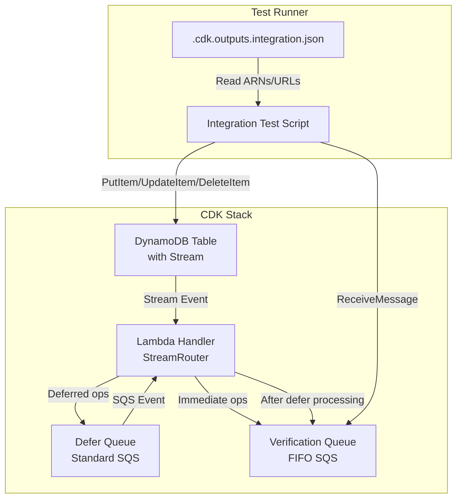

# Design Document: Integration Test Infrastructure

## Overview

This feature provides a complete end-to-end integration testing solution for the ddb-stream-router library. It consists of:

1. A CDK stack that deploys all necessary AWS infrastructure
2. A Lambda handler that uses StreamRouter with immediate and deferred handlers
3. A test runner script that performs DynamoDB operations and validates handler execution

The test flow:
1. Deploy CDK stack → outputs resource ARNs to JSON file
2. Test runner reads outputs, performs DynamoDB operations
3. Lambda processes stream events, writes to verification FIFO queue
4. Test runner polls verification queue, validates expected messages
5. Clean up with CDK destroy

## Architecture



## Components and Interfaces

### 1. CDK Stack (`integ/stack.ts`)

```typescript
interface IntegrationTestStackProps extends cdk.StackProps {
  outputFile?: string; // Default: '.cdk.outputs.integration.json'
}

// Resources created:
// - DynamoDB Table: pk (string), sk (string), stream NEW_AND_OLD_IMAGES
// - Lambda Function: Node.js 20, bundled handler code
// - Defer Queue: Standard SQS queue
// - Verification Queue: FIFO SQS queue with content-based deduplication
// - Event Source Mappings: Stream → Lambda, Defer Queue → Lambda
// - IAM: Lambda permissions for DynamoDB, SQS
```

### 2. Lambda Handler (`integ/handler.ts`)

```typescript
import { StreamRouter, createSQSClient } from '../src';
import { SQSClient, SendMessageCommand } from '@aws-sdk/client-sqs';

interface TestItem {
  pk: string;
  sk: string;
  data?: string;
}

interface VerificationMessage {
  operationType: 'INSERT' | 'MODIFY' | 'REMOVE';
  isDeferred: boolean;
  pk: string;
  sk: string;
  timestamp: number;
}

// Router configuration:
// - Immediate handlers for INSERT, MODIFY, REMOVE → write to verification queue
// - Deferred handler for INSERT → enqueue to defer queue, then write to verification queue
```

### 3. Test Runner (`integ/run-tests.ts`)

```typescript
interface TestConfig {
  tableArn: string;
  tableName: string;
  verificationQueueUrl: string;
  deferQueueUrl: string;
}

// Test sequence:
// 1. Load config from outputs JSON
// 2. Create test item → expect immediate INSERT + deferred INSERT messages
// 3. Modify test item → expect immediate MODIFY message
// 4. Delete test item → expect immediate REMOVE message
// 5. Validate all messages received with correct content
// 6. Report results
```

## Data Models

### DynamoDB Table Schema

| Attribute | Type | Description |
|-----------|------|-------------|
| pk | String | Partition key (e.g., "TEST#item1") |
| sk | String | Sort key (e.g., "v0") |
| data | String | Optional test data |

### Verification Message Schema

```typescript
interface VerificationMessage {
  operationType: 'INSERT' | 'MODIFY' | 'REMOVE';
  isDeferred: boolean;
  pk: string;
  sk: string;
  timestamp: number;
  eventId?: string;
}
```

### CDK Outputs Schema

```typescript
interface CdkOutputs {
  IntegrationTestStack: {
    TableArn: string;
    TableName: string;
    DeferQueueUrl: string;
    VerificationQueueUrl: string;
    HandlerFunctionArn: string;
  };
}
```

## Correctness Properties

*A property is a characteristic or behavior that should hold true across all valid executions of a system-essentially, a formal statement about what the system should do. Properties serve as the bridge between human-readable specifications and machine-verifiable correctness guarantees.*

Based on the prework analysis, all acceptance criteria are testable as examples (specific integration test scenarios) rather than properties (universal rules across all inputs). This is appropriate for integration testing where we verify specific end-to-end flows rather than exhaustive input coverage.

The integration tests will verify:

**Example 1: INSERT triggers both immediate and deferred handlers**
- Create an item in DynamoDB
- Poll verification queue
- Assert: 2 messages received (immediate INSERT + deferred INSERT)
- Assert: Messages contain correct pk, sk, operationType, isDeferred flag
**Validates: Requirements 2.1, 2.4, 2.5, 3.1, 5.1-5.4**

**Example 2: MODIFY triggers immediate handler**
- Modify an existing item
- Poll verification queue
- Assert: 1 message received (immediate MODIFY)
- Assert: Message contains correct operationType and item keys
**Validates: Requirements 2.2, 3.2**

**Example 3: REMOVE triggers immediate handler**
- Delete an item
- Poll verification queue
- Assert: 1 message received (immediate REMOVE)
- Assert: Message contains correct operationType and item keys
**Validates: Requirements 2.3, 3.3**

## Error Handling

| Scenario | Handling |
|----------|----------|
| CDK deployment fails | Exit with error, display CloudFormation error |
| Lambda handler error | Logged, batch item failure returned for retry |
| Verification queue timeout | Test fails with timeout error after 60s |
| Missing expected messages | Test fails with assertion error listing missing ops |
| Invalid message format | Test fails with parse error |

## Testing Strategy

### Integration Tests (Primary)

The integration tests are the primary testing mechanism for this feature. They verify:

1. **Infrastructure deployment** - CDK stack deploys successfully, outputs file created
2. **Stream processing** - INSERT/MODIFY/REMOVE events trigger handlers
3. **Deferred processing** - Deferred handler enqueues and processes correctly
4. **Message format** - Verification messages contain all required fields

### Test Execution

```bash
# Deploy infrastructure
cd integ && npx cdk deploy --outputs-file ../.cdk.outputs.integration.json

# Run integration tests
npx ts-node integ/run-tests.ts

# Clean up
cd integ && npx cdk destroy
```

### Test Assertions

Using Node.js built-in `assert` module for simplicity:

```typescript
import assert from 'node:assert';

// Verify message count
assert.strictEqual(messages.length, expectedCount, `Expected ${expectedCount} messages`);

// Verify message content
assert.strictEqual(msg.operationType, 'INSERT');
assert.strictEqual(msg.isDeferred, false);
assert.strictEqual(msg.pk, expectedPk);
```

### Timeout Handling

- Verification queue polling: 60 second timeout with 5 second intervals
- DynamoDB stream processing: ~1-2 seconds typical latency
- Deferred processing: Additional ~1-2 seconds for SQS → Lambda
